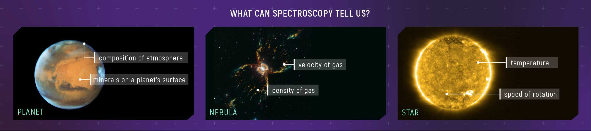

## Course repository for the ***Python for Spectroscopy Summer 2024*** Workshop 
### taught for BRIEF Boyce Astro Foundation by Chandru Narayan



## Welcome to Python for Spectroscopy Workshop! 
## [Google Classroom can be accessed here](https://classroom.google.com/c/NzAxMDY5MTYyMTkx)

#### ***Workshop commences 8:00 PM Pacific Time Thursday, July 18th 2024. See below for details***

Our workshop will cover a smattering of interesting or historically significant Spectroscopy topics in no particular sequence.  However, the main goal of this course is to teach critical college and research skills that you will need as a student & professional. We will attempt to develop these skills primarily on Spectroscopy related topics as you clearly are astro enthusiasts!  The primary audience for this course are High School, College students, or Early Career professionals. We also care about accessibility of these resources across student communities who may be underrepresented and of a diverse socio economic background. We hope to keep these resources free and open for use as much as possible to anyone who may be interested.  

Skills we will teach might include:
1. Mind Maps to organize our thoughts. We will use [LucidChart](https://www.lucidchart.com/pages/landing?utm_source=google&utm_medium=cpc&utm_campaign=_chart_en_us_mixed_rlsa_brand_exact&km_CPC_CampaignId=20744746494&km_CPC_AdGroupID=163925669228&km_CPC_Keyword=lucidchart&km_CPC_MatchType=e&km_CPC_ExtensionID=&km_CPC_Network=g&km_CPC_AdPosition=&km_CPC_Creative=679878152768&km_CPC_TargetID=aud-2227034459243:kwd-33511936169&km_CPC_Country=9033313&km_CPC_Device=c&km_CPC_placement=&km_CPC_target=&gad_source=1&gclid=Cj0KCQjw-uK0BhC0ARIsANQtgGN0flS_Pc3KUR2rcDT09ZjBpaziv3CXT0_s9x3jVwOnU_m1EnBVz7AaAp7cEALw_wcB) for this purpose during this course.
1. Jupyter Notebooks (the backbone of JupyterLab & Google colab)
1. JupyterHub & JupyterLab (dev environment for Jupyter Notebooks adopted widely by universities)
1. Markdown Syntax (dynamic text, images, video and code embedded publishing)
1. LaTeX (web and github enables equation editor for research)
1. Python (language of choice for data science and STEM publications)
1. Matplotlib (plotting large amounts of data)
1. Pandas & Numpy (dataframes and math libraries for Python)
1. SQL (structured query language for querying astro databases)

We expect to run for 5 sessions ***every Thursday July 18th 2024***. Look for the Google Meet schedule links to be available at the end of this page. 

Please check this website & classroom for ALL UPDATES.  I will try not to send emails or notifications for any updates.  All materials will show up on this link below.  So please bookmark it check it frequently. 

## What is Jupyter?

If you are not familiar with [Project Jupyter](http://jupyter.org/), [Jupyter Notebook](https://jupyter.org/try-jupyter/retro/notebooks/?path=notebooks/Intro.ipynb) [JupyterLab](https://jupyter.org/try-jupyter/retro/notebooks/?path=notebooks/Intro.ipynb) or [JupyterHub](http://jupyter.org/hub), I highly recommend learning about them by following the embedded links.  

All of the content provided here are accessible to you using a combination of technologies provided by [Jupyter](http://jupyter.org/) and [Github](https://github.com/) where 83+ million researchers around the world come together to publish the share their work.  

You will be accessing your own 'virtual laptop' hosted on a Google virtual machine somewhere in the globe to do your work.  You class materials will be available to you there and you will store the products of your learning there and not on your physical computer from which you are accessing this course. Your work will be to modify the Jupyter Notebooks to add text, images, video, to write your own code, query and retrieve astronomical databases, analyze and plot your results graphically.

## Validate your JupyterLab Login for use later!

You will be logging into JupyterHub for getting workshop materials and creating your own Jupyter Notebooks.  Your username is simply ```<your first name>.``` followed by ```<your last name>.``` followed by the word ```p4s``` you ```provided in your registration```. For instance, my username would be ```chandru.narayan.p4s```  . The first time you will log in, create a password you make up yourself.  That will become your actual password for this JupyterHub - please try not to forget it.  If you do, email me at drunarayan@gmail.com, I will reset it.

firstname|lastname|email|username
---|---|---|---
Velne|Barud|vlbarud.eid@gmail.com|Velne.Barud.p4s
Dinesh|Shetty|dvshetty98@gmail.com|Dinesh.Shetty.p4s
Rinisha|Ramprakash|rinisha03@gmail.com|Rinisha.Ramprakash.p4s
Julian|Yang|julian.yang0111@gmail.com|Julian.Yang.p4s
Rajaabirami|R|rajaabirami01@gmail.com|Rajaabirami.R.p4s
Puneet|Sethi|puneetsethi16042004@gmail.com|Puneet.Sethi.p4s
Alexander|Huang|alexanderhuang499@gmail.com|Alexander.Huang.p4s
Elaina|Jeansonne|enjeansonne@outlook.com|Elaina.Jeansonne.p4s
Mike|Pereira|mikpere@icloud.com|Mike.Pereira.p4s
Tyler|Tuttle|tntuttle11@gmail.com|Tyler.Tuttle.p4s
Heinz|Vahlbruch|hello@heinzvahlbruch.com|Heinz.Vahlbruch.p4s
Louis|Petersen|spaceagencyneptune@gmail.com|Louis.Petersen.p4s

## Workshop organization & JupyterHub - your own virtual laptop in the sky!

The structure of this Workshop includes specific ***Projects*** below.  These Projects provide access to multiple materials, including **your own virtual laptop**, Jupyter Notebooks, media files (images, video), presentations, PDF files, CSV files, database files and the like.  Each Project wil have its own collection of content linked below.  When you click on the very first project link below to get started!

When you do so, it will make your own initial copy to your JupyterHub account and allow you to edit and modify them.  As you modify them, ***JupyterLab*** (the IDE inside JupyterHub) will keep track of the modifications and you ***should never lose your edits***.  It is highly recommended that you ***do not change the names of the notebooks or files*** as they are being tracked and version controlled. You can always return to this page to access any specific project below where you can access your latest edits.  JupyterHub is widely used and state-of-the-art mechanism that universities use to manage Jupyter Notebooks and other course materials.  It is expected that future courses taught by me for BRIEF Programs will provide access to the same user account you are using now.

## Projects & Materials Access
We will make extensive use of the materials from the [Webb Space Telescope - Spectroscopy 101 course](https://webbtelescope.org/contents/articles/spectroscopy-101--introduction) and the very useful and [free online Astronomy textbook from OpenStax](https://openstax.org/details/books/astronomy-2e)

#### Please complete these steps below ahead of the first session
* [Access Online OpenStax Astronomy Textbook here and read the Section on Radiation & Spectra](https://openstax.org/books/astronomy-2e/pages/5-thinking-ahead)
* Start ```Project 1: Intro to Jupyter Notebooks``` should be available for you to create your first lines of code in Python for this class.  I encourage you to click the first project below, ***login with your username and password as identified in the previous paragraphs***. See if you can complete this ahead of our first session!  Your username should be created [if you have successfully registered for this course](https://docs.google.com/forms/d/e/1FAIpQLSf1maaYNhONbsg75rNPMYaQUyUP8SZHVcrIb6i7c0BvTOqbSQ/viewform)


Project|Topic Description
---|---
1|<a href="https://drunarayan.github.io/python4spectroscopy/intro_jupyter_python" target="_blank">Start your first project - Intro to Jupyter Notebooks & Spectroscopy</a>
2|<a href="https://drunarayan.github.io/python4spectroscopy" target="_blank">Light & Matter</a>
3|<a href="TBD" target="_blank">Absorption & Emission Spectra</a>
4|<a href="https://drunarayan.github.io/python4spectroscopy/half_a_mil" target="_blank">Spectral Properties of Stars & Galaxies</a>
5|<a href="TBD" target="_blank">Analyse JWST & other Spectral Images</a>
6|<a href="TBD" target="_blank">Optional Project - Build your own Raspberry PI Spectroscope!</a>


## Workshop Zoom Meeting and Recording Links 

Item|Date|Google Meet Link|Google Recording Link
---|---|---|---
1|Thu, Jul 18th, 2024 8:00 - 9:00 PM Pacific Time|[Google Meet link](https://meet.google.com/dqv-dvez-exk)|[Google Meeting Recording](https://drive.google.com/file/d/1k3GLDfvOFVycK48Wfdc7Ec7CMMy6cMjP/view?usp=sharing)
2|Thu, Jul 25th, 2024 8:00 - 9:00 PM Pacific Time|[Google Meet link](https://meet.google.com/dqv-dvez-exk)|[Google Meeting Recording](TBD)
3|Thu, Aug 1st, 2024 8:00 - 9:00 PM Pacific Time|[Google Meet link](https://meet.google.com/dqv-dvez-exk)|[Google Meeting Recording](TBD)
4|Thu, Aug 8th, 2024 8:00 - 9:00 PM Pacific Time|[Google Meet link](https://meet.google.com/dqv-dvez-exk)|[Google Meeting Recording](TBD)
5|Thu, Aug 15th, 2024 8:00 - 9:00 PM Pacific Time|[Google Meet link](https://meet.google.com/dqv-dvez-exk)|[Google Meeting Recording](TBD)


 
